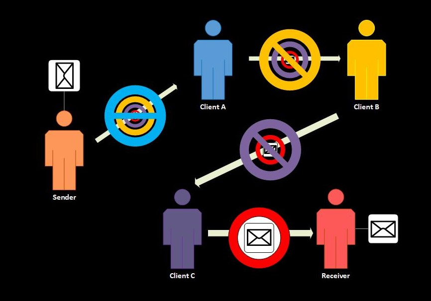

# 2018s-onion-team6

## Greeting
```
::::::::::::::::::::::::::::::::::::::::::::::::::::::::::::::::::::
                     _ _____ _____    ___        _             
                    | |  ___|  ___|  / _ \ _ __ (_) ___  _ __  
                 _  | | |_  | |_    | | | | '_ \| |/ _ \| '_ \ 
                | |_| |  _| |  _|   | |_| | | | | | (_) | | | |
                 \___/|_|   |_|      \___/|_| |_|_|\___/|_| |_|
                                                               
                __  __                                           
               |  \/  | ___  ___ ___  __ _ _ __   __ _  ___ _ __ 
               | |\/| |/ _ \/ __/ __|/ _` | '_ \ / _` |/ _ \ '__|
               | |  | |  __/\__ \__ \ (_| | | | | (_| |  __/ |   
               |_|  |_|\___||___/___/\__,_|_| |_|\__, |\___|_|   
                                                 |___/           
::::::::::::::::::::::::::::::::::::::::::::::::::::::::::::::::::::
```

## Abstract
- Project for **Onion messenger**
  + Onion messenger is inspired by [onion
routing](https://en.wikipedia.org/wiki/Onion_routing) like [Tor](https://en.wikipedia.org/wiki/Tor_(anonymity_network)).
  + It anonymizes messages between clients using PGP.
  + Message transmission route changes randomly.
  + The sender and the receiver of a message can see
the message, but other clients cannot see its content or figure out who is
sending the message to whom like following picture.
  

## Table of contents
* [Getting Started](#getting-started)
  * [Clone git repository](#clone-git-repository)
  * [Prerequisites](#prerequisites)
  * [Installation](#installation)
  * [PGP key](#pgp-key)
* [Running the App](#getting-started)
  * [In local](#in-local)
  * [In docker](#in-docker)
* [Usage](#usage)
* [Running Examples](#running-examples)
* [Details](#details)
  * [Protocols](#protocols)
  * [Source Code](#source-code)
* [Authors](#authors)

## Getting Started

### Clone git repository

```
# Clone this repository
$ git clone https://github.com/KAIST-IS521/2018s-onion-team6.git

# Go into the repository
$ cd 2018s-onion-team6
```

### Prerequisites

You can install using `setup.sh`.
```
# Install dependencies
$ ./setup.sh
```

Or, you can install separately using following command.

- We compile our program with `clang`

  ```
  $ sudo apt-get install -y clang-5.0
  ```

- You can test our messenger in `docker`

  ```
  $ sudo apt-get install -y docker-ce

  # verify installation
  $ sudo docker run hello-world
  ```

### Installation

```
# Build 
$ make

# Remove object files
$ make clean
```

### PGP key

If you don't have the PGP key, you should make it. </br>
And you have to export your private key to this repo's `private.key` file.

```
# Generate a new keypair
$ gpg --gen-key

# Export private key to file
$ gpg --export-secret-keys -a > private.key
```

Or, you can use our test private key in `TEST_KEYS`.


## Running the App

### In local

```
# Run the app
$ ./Build/onion
```

### In docker

```
# Build docker image
$ ./1_build_docker.sh ${1}  // $1 is prepared private key number (1~5).

# Run it as one container
$ ./2_container_docker.sh ${CONTAINER_NAME}
```

## Usage

```
 USAGE : # [COMMAND]
           {help}                        : print usage
           {send} {GIT_ID}               : send message
                            -> {MESSAGE} : input message
           {ls}                          : show received message list
           {cat} {GIT_ID}                : print recvived message
           {id}                          : show my info
           {w}                           : show member list
           {exit}                        : program exit
```

## Running Examples

```
[+] GIT_ID > User1
[+] Private key password > *******
 USAGE : # [COMMAND]
           {help}                        : print usage
           {send} {GIT_ID}               : send message
                            -> {MESSAGE} : input message
           {ls}                          : show received message list 
           {cat} {GIT_ID}                : print recvived message
           {id}                          : show my info
           {w}                           : show member list
           {exit}                        : program exit

 # id
 [*] User1 (172.17.0.2::FEB3816B)
 # w
 ::::::::::   ONLINE MEMBER LIST   :::::::::::
 [*] Git Id (IP :: PGP Key Id)
 [+] User4 (172.17.0.5::14200C42)
 [+] User3 (172.17.0.4::CFBA0DB9)
 [+] User2 (172.17.0.3::89563D67)
 [+] User1 (172.17.0.2::FEB3816B)
 # send User4
 # send @ <User4> : Hello
 # send @ <User4> : I'm User4.
 # send @ <User4> : 

 # 
[!] [ User4 ]'s Message arrived 
 [+] msg > Hi!

 # ls

User4
 # cat User4
 [+] msg > Hi!
```

## Details

### Protocols

- Send packets using json format

1. Update Peer List

  ```
    |        flag        |     github_id    |        pgp_key_id        |
    |--------------------|------------------|--------------------------|
    | 0(dead) or 1(live) | user's github id | user's pgp public key id |
  ```

2. Send/Recv Message

  ```
    |     sender     |     receiver     |             data             |
    |----------------|------------------|------------------------------|
    | message sender | message receiver | plain data or encrypted data |
  ```

### Source Code

```
main.cpp            : Include main function
onion_messenger.cpp : OnionMessenger main class
shell.cpp           : User interface
user_info.cpp       : User information class
socket.cpp          : Include socket wrapper functions
heartbeat.cpp       : Send and receive broadast message for updating peer list
msgclient.cpp       : Encrypt message and send it
msgserver.cpp       : Receive message, decrypt data, decide to read or forward
pgpmanager.cpp      : Include gpg wrapper functions
```

## Authors
 * Team JFF [Just For Fun]
   * Soohun Kim (L)
   * Sunnyeo Park
   * Sangsup Lee
   * Hyungseok Han (TA)
